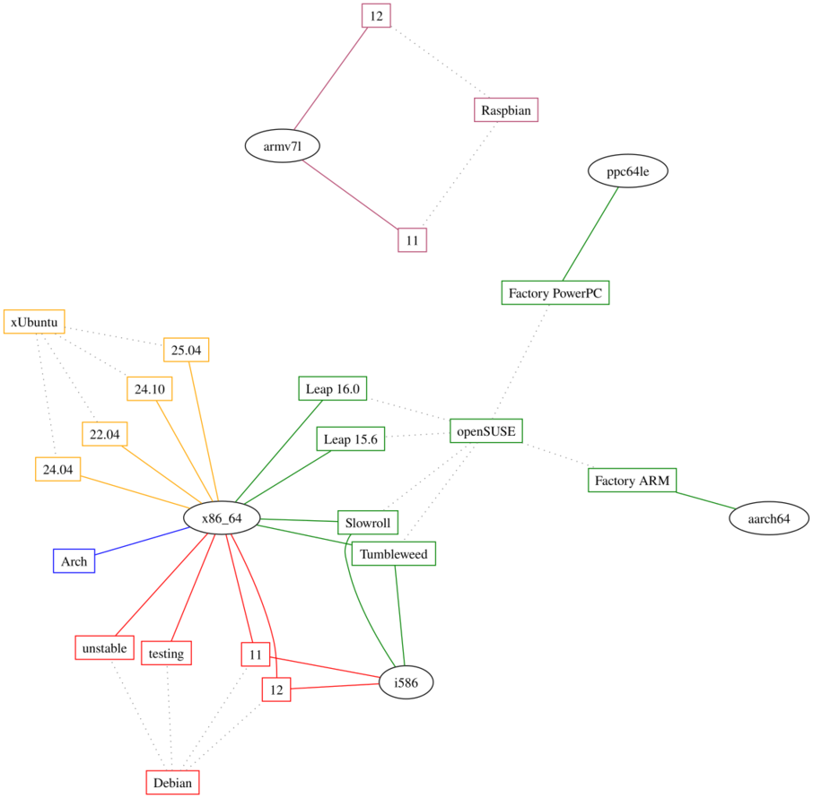

# OBS

Config files used by the Open Build Service to provide EasyRPG GNU/Linux builds

All subfolders contain all needed metadata files for the package by that name.

## Project Home

https://build.opensuse.org/project/show/home:easyrpg

## Download Page

https://software.opensuse.org/download.html?project=home%3Aeasyrpg&package=easyrpg-player

## Current Distribution Support

### Notes

Additional Architectures like ARM cannot be tested by us and are unsupported. We appreciate feedback. :)
